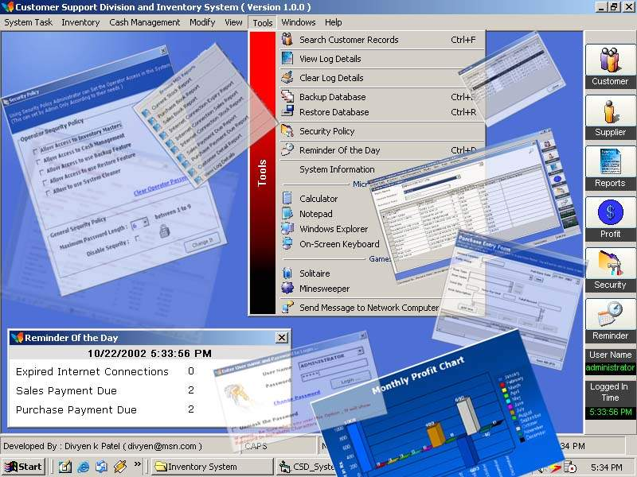

<div align="center">

## Inventory Control System


</div>

### Description

Inventory Control System - For Retail Store <br/>

A Complete MIS SYSTEM [With Customer Support System, Financial Management System , Inventory Control System Including Sales, Purchase, Bills Receivable and Payable, Income and Expense maintenance] With 14 Useful Reports created in crystal report.

Inventory Control System - For Retail Store

A Complete MIS SYSTEM [With Customer Support System, Financial Management System,

Inventory Control System Including Sales, Purchase, Bills Receivable and Payable,

Income and Expense maintenance]

With 14 Useful Reports created in crystal report.

[For Beginners / Intermediate and Advanced]

Major Feature is that you can run whole application with keyboard only

and that gives ease to User.

It has developed by considering all real time business transactions.

It store Customer Information so that it can be referred later on that

helps in Customer Support System.

When you perform any purchase or sales transaction it automatically

updates inventory and you can have current stock report.

You can also issue bills to customer from this software as soon

as you issue sales transaction.

Moreover it also have reminder that reminds you on Due bills

which is available at the bottom of the software.

You can also take back up of your database and later on you can restore it

also but be careful while you are restoring, select appropriate file for restore.

You can also have Consistency with Customer names and Suppliers with of them is

assigned on id that is automatically incremented as you add more names in to it.

In customer search you can have all entries he/she has bought up to now along

with their Sales Invoice Details. You can also add new customer records in case

of future reference.

You can also manage your day to day miscellaneous incomes and expenses in this application.

It also provides feature so that you can sends messages to other Computers in your network

[This feature uses net send command &#8211; so might not work with win98]

This system provides 14 different Reports so that you can have better analysis

and also shows you each month&#8217;s profit and loss in chart.

Security

----

This system basically has two different types of user

1. Administrator

2. Operator

Administrator can set security policy for operator through separate security form.

Each user can also change their passwords.

If operator forgets his password then administrator can change it to default password.

i.e. op which is defined in this application.

Logs

----

This application also logs Log in time and log out time of operator so that

you can administrator can determine when operator has made an entry.

From the Tools menu you can also have access to many of inbuilt windows tool

like Calc, explorer etc so that need not required to minimize your application.

Warning :

----

Lot of Students, are submitting this work as their student Project, in Colleges

and i got lot of mails from them, I advice not to do so,

if inquiry is done you will be definitely in trouble,

so use it for learning purpose only.

----

Sale of this product strongly Prohibited.
 
### More Info
 


<span>             |<span>
---                |---
**Submitted On**   |2002-11-03 03:47:48
**By**             |[Divyen Patel](https://github.com/Planet-Source-Code/PSCIndex/blob/master/ByAuthor/divyen-patel.md)
**Level**          |Intermediate
**User Rating**    |4.6 (2065 globes from 445 users)
**Compatibility**  |VB 6\.0, VBA MS Access
**Category**       |[Complete Applications](https://github.com/Planet-Source-Code/PSCIndex/blob/master/ByCategory/complete-applications__1-27.md)
**World**          |[Visual Basic](https://github.com/Planet-Source-Code/PSCIndex/blob/master/ByWorld/visual-basic.md)
**Archive File**   |[A\_Complete1492431152002\.zip](https://github.com/Planet-Source-Code/divyen-patel-inventory-control-system__1-40440/archive/master.zip)

### API Declarations

```
Inventory Control System - For Retail Store
A Complete MIS SYSTEM [With Customer Support System, Financial Management System,
Inventory Control System Including Sales, Purchase, Bills Receivable and Payable,
Income and Expense maintenance]
With 14 Useful Reports created in crystal report.
[For Beginners / Intermediate and Advanced]
Major Feature is that you can run whole application with keyboard only
and that gives ease to User.
It has developed by considering all real time business transactions.
It store Customer Information so that it can be referred later on that
helps in Customer Support System.
When you perform any purchase or sales transaction it automatically
updates inventory and you can have current stock report.
You can also issue bills to customer from this software as soon
as you issue sales transaction.
Moreover it also have reminder that reminds you on Due bills
which is available at the bottom of the software.
You can also take back up of your database and later on you can restore it
also but be careful while you are restoring, select appropriate file for restore.
You can also have Consistency with Customer names and Suppliers with of them is
assigned on id that is automatically incremented as you add more names in to it.
In customer search you can have all entries he/she has bought up to now along
with their Sales Invoice Details. You can also add new customer records in case
of future reference.
You can also manage your day to day miscellaneous incomes and expenses in this application.
It also provides feature so that you can sends messages to other Computers in your network
[This feature uses net send command &#8211; so might not work with win98]
This system provides 14 different Reports so that you can have better analysis
and also shows you each month&#8217;s profit and loss in chart.
Security
--------
This system basically has two different types of user
1. Administrator
2. Operator
Administrator can set security policy for operator through separate security form.
Each user can also change their passwords.
If operator forgets his password then administrator can change it to default password.
i.e. op which is defined in this application.
Logs
----
This application also logs Log in time and log out time of operator so that
you can administrator can determine when operator has made an entry.
From the Tools menu you can also have access to many of inbuilt windows tool
like Calc, explorer etc so that need not required to minimize your application.
Warning :
=========
Lot of Students, are submitting this work as their student Project, in Colleges
and i got lot of mails from them, I advice not to do so,
if inquiry is done you will be definitely in trouble,
so use it for learning purpose only.
==========================================
Sale of this product strongly Prohibited.
```


